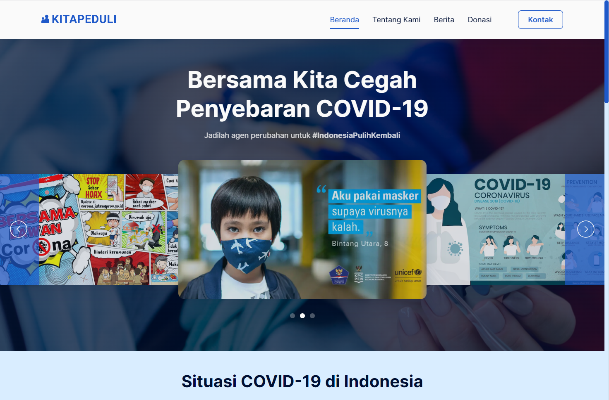

# KitaPeduli
Situs bernama KitaPeduli yang bertujuan untuk memberikan informasi seputar COVID-19 kepada pengguna, sekaligus menjadi sarana bagi masyarakat untuk berdonasi kepada terkena dampak pandemi dan membutuhkan bantuan.

Untuk melihat hasil akhirnya, [Klik Disini.](https://ervin-sungkono.github.io/Kita-Peduli)

## Preview Image


## Referensi
1. https://covid19.go.id/
2. https://www.bbc.com/indonesia/indonesia-52127554
3. https://berita.murungrayakab.go.id/tenaga-kesehatan-mendapat-dukungan-dari-kpb-dan-kompak-kalteng/20/08/2021/
4. https://www.pexels.com/photo/people-walking-on-green-mountain-wearing-raincoats-4956502/
5. https://kitabisa.com
6. https://unsplash.com/photos/AEaTUnvneik
7. https://unsplash.com/photos/GDokEYnOfnE
8. https://unsplash.com/photos/T4ciXluAvIE
9. https://unsplash.com/photos/KFdrrt0EXQ8
10. https://unsplash.com/photos/K0E6E0a0R3A

## API Source
1. https://github.com/Reynadi531/api-covid19-indonesia-v2

## Installation
1. Clone the project
```sh
git clone https://github.com/ervin-sungkono/Kita-Peduli-Invention2022.git
```
2. Install required modules
```sh
npm install
```
3. Run project
```sh
npm start
```
## Tim
Projek ini dibuat oleh tim 3 orang yang terdiri dari:
- Ervin Cahyadinata Sungkono
- Ignatius Michael Dinata
- Benedic Matthew Halim
